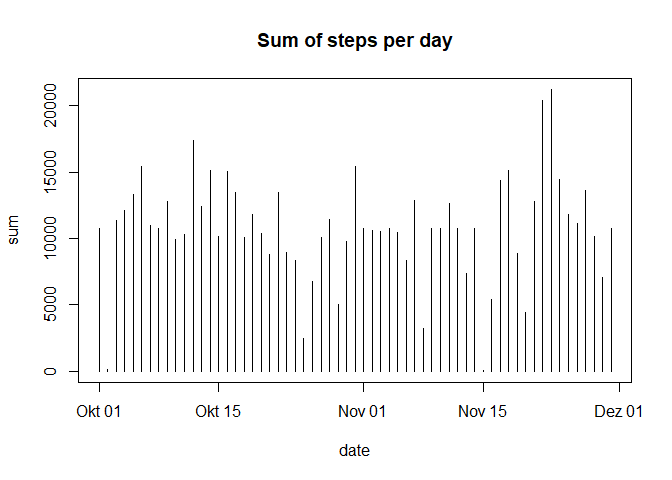

Loading and preprocessing the data
----------------------------------

For the following code to work it is required that the gitHub repository
<https://github.com/rdpeng/RepData_PeerAssessment1> has been cloned
**into your working directory**, and that the file *activity.zip* is
found there. First we load the file *activity.csv* into R and assign the
contents to the variable *activity*. Then we look at the structure of
*activity*.

    unzip("activity.zip")
    activity <- read.csv("activity.csv")
    str(activity)

    ## 'data.frame':    17568 obs. of  3 variables:
    ##  $ steps   : int  NA NA NA NA NA NA NA NA NA NA ...
    ##  $ date    : Factor w/ 61 levels "2012-10-01","2012-10-02",..: 1 1 1 1 1 1 1 1 1 1 ...
    ##  $ interval: int  0 5 10 15 20 25 30 35 40 45 ...

The variable *date* is currently handled as a factor. So we convert it
to the date-format.

    activity$date <- as.Date(as.character(activity$date))

What is mean total number of steps taken per day?
-------------------------------------------------

In order to calculate the total number of steps per day, the
*dplyr*-package is loaded. The dataframe *activity* is then grouped by
date and summarized with the sum of steps per day assigned to the
variable *sum*. Lastly, a plot is created using the base
plotting-package with *type = h*, which plots the data as histogram-like
vertical lines.

    library(dplyr)

    ## 
    ## Attaching package: 'dplyr'

    ## The following objects are masked from 'package:stats':
    ## 
    ##     filter, lag

    ## The following objects are masked from 'package:base':
    ## 
    ##     intersect, setdiff, setequal, union

    sum_steps <- activity %>% group_by(date) %>% summarize(sum = sum(steps, na.rm = TRUE))
    plot(sum_steps, type = "h", main = "Sum of steps per day")

Then we calculate the mean and median of the total number of steps taken
per day.

    act_mean <- mean(sum_steps$sum)
    act_med <- median(sum_steps$sum)

The mean number of steps per day is 9354.2295082, the median is 10395.

What is the average daily activity pattern?
-------------------------------------------

Here, again, we group the dataframe *activity*, but this time by the
variable *interval*. We then summarize it with the mean of steps per
interval assigned to the variable *mean*. This new dataframe is then
plotted with *type* set to *"l"*.

    av_steps <- activity  %>% group_by(interval) %>% summarize(mean = mean(steps, na.rm = TRUE))
    plot(av_steps, type = "l", main = "Average number of steps per interval")

Next we compute the 5-minute interval, on average across all the days in
the dataset, which contains the maximum number of steps:

    head(arrange(av_steps, desc(mean)),1)

    ## Warning: package 'bindrcpp' was built under R version 3.4.4

    ## # A tibble: 1 x 2
    ##   interval  mean
    ##      <int> <dbl>
    ## 1      835  206.

We learn that interval 835 contains the highest number of steps.

Imputing missing values
-----------------------

First, we calculate the number of missing values per variable.

    colSums(is.na(activity))

    ##    steps     date interval 
    ##     2304        0        0

Apparently, missing values only appear in the variable *steps* and there
are 2304 of them.

In order to fill in all of the missing values in the dataset, i decide
to replace them with the average number of steps across all days for the
given interval. These steps are performed on the new dataset
*activity2*, which is created as an exact copy of *activity*:

    activity2 <- activity
    for (i in 1:nrow(activity2)) {
      if(is.na(activity2[i,1])) activity2[i,1] = mean(subset(activity2, interval == activity2[i,3])[,1], na.rm = TRUE)
    }

We calculate and plot the total number of steps per day as previously,
only this time with imputed missing values, so we use the dataset
*activity2*:

    sum_steps2 <- activity2 %>% group_by(date) %>% summarize(sum = sum(steps))
    plot(sum_steps2, type = "h", main = "Sum of steps per day")

Again, we calculate the mean and median of the total number of steps
taken per day.

    act_mean2 <- mean(sum_steps2$sum)
    act_med2 <- median(sum_steps2$sum)

The mean number of steps per day is 1.076618910^{4}, the median is
1.076618910^{4}. They are obviously and strangely identical, which can
be explained by all values being identical. However, this is not the
case, as the plot and also the following summary shows:

    summary(sum_steps2$sum)

    ##    Min. 1st Qu.  Median    Mean 3rd Qu.    Max. 
    ##      41    9819   10766   10766   12811   21194

This seems to be the or an effect of the method used for imputing the
missing values.

Are there differences in activity patterns between weekdays and weekends?
-------------------------------------------------------------------------

We create a new factor variable in the dataset with two levels -
"weekday" and "weekend" - indicating whether a given date is a weekday
or weekend day. First, we create a character-vector containing the
abbreviated weekdays in German.

    weekday <- c("Mo","Di","Mi","Do","Fr")

Then we add a fourth column "Day" to the dataset *activity2* which is
converted to a factor.

    for (i in 1:nrow(activity2)) {
      if(weekdays(activity2[i,2], abbreviate = TRUE) %in% weekday) (activity2[i,4] = "weekday")
        else activity2[i,4] = "weekend"
    }
    activity2$V4 <- as.factor(activity2$V4)
    activity2 <- rename(activity2, Day = V4)
    str(activity2)

    ## 'data.frame':    17568 obs. of  4 variables:
    ##  $ steps   : num  1.717 0.3396 0.1321 0.1509 0.0755 ...
    ##  $ date    : Date, format: "2012-10-01" "2012-10-01" ...
    ##  $ interval: int  0 5 10 15 20 25 30 35 40 45 ...
    ##  $ Day     : Factor w/ 2 levels "weekday","weekend": 1 1 1 1 1 1 1 1 1 1 ...

We see that the new variable *Day* is indeed a factor with the two
levels "weekday" and "weekend".

Now we create two datasets, one for weekdays only, one for weekends
only, where each contains the average number of steps per interval.

    weekday_mean <- activity2 %>% filter(Day == "weekday") %>% group_by(interval) %>% summarize(mean = mean(steps))
    weekend_mean <- activity2 %>% filter(Day == "weekend") %>% group_by(interval) %>% summarize(mean = mean(steps))

Lastly, we create two time series plots of the 5-minute interval and the
average number of steps taken, averaged across all weekday days or
weekend days:

    par(mfrow = c(2,1))
    plot(weekday_mean, type="l", main = "Average steps on weekdays")
    plot(weekend_mean, type="l", main = "Average steps on Weekends")

